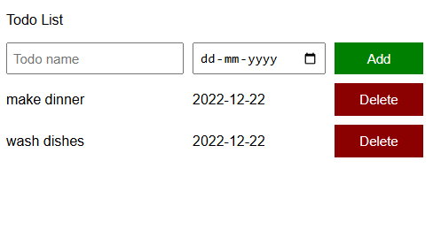

# To-Do List Application

This is a simple, interactive To-Do List application built with HTML, CSS, and JavaScript. It allows users to manage their daily tasks efficiently by adding, viewing, and deleting tasks with due dates.

## Features

- **Add Tasks**: Input task names and due dates to create new to-do items.
- **View Tasks**: Display all added tasks in an organized list.
- **Delete Tasks**: Remove completed or unnecessary tasks from the list.
- **Responsive Design**: Styled with CSS to ensure a clean and user-friendly interface.

## Technologies Used

- **HTML**: For the basic structure of the application.
- **CSS**: For styling and layout, including grid-based task display.
- **JavaScript**: For dynamic functionality such as adding, displaying, and deleting tasks.

## How to Use

1. **Add a Task**:
   - Enter the task name in the "Todo name" field.
   - Select a due date using the date picker.
   - Click the "Add" button to save the task to the list.

2. **View Tasks**:
   - All tasks are displayed in a grid format showing the task name and due date.

3. **Delete a Task**:
   - Click the "Delete" button next to a task to remove it from the list.

## Project Structure

```
Project Folder
├── To-DO-List.html      # Main HTML file for the structure of the application
├── todolist.css         # CSS file for styling and layout
├── todolist.js          # JavaScript file for dynamic functionality
```

## Screenshots




## Author

- **Shailes Pillai**  
- [GitHub Profile](https://github.com/shyLesh001)  
- [LinkedIn Profile](https://linkedin.com/in/shylesh001)


